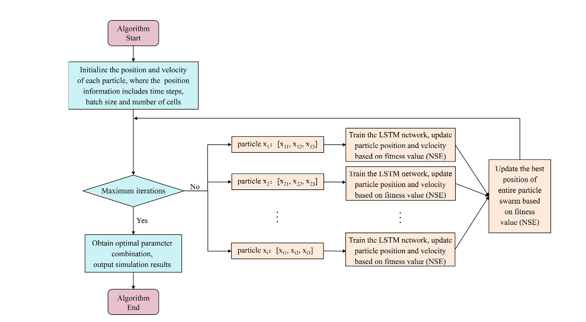
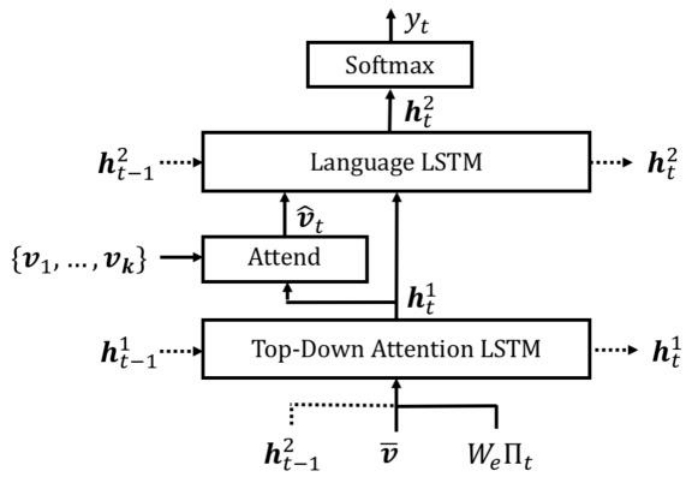
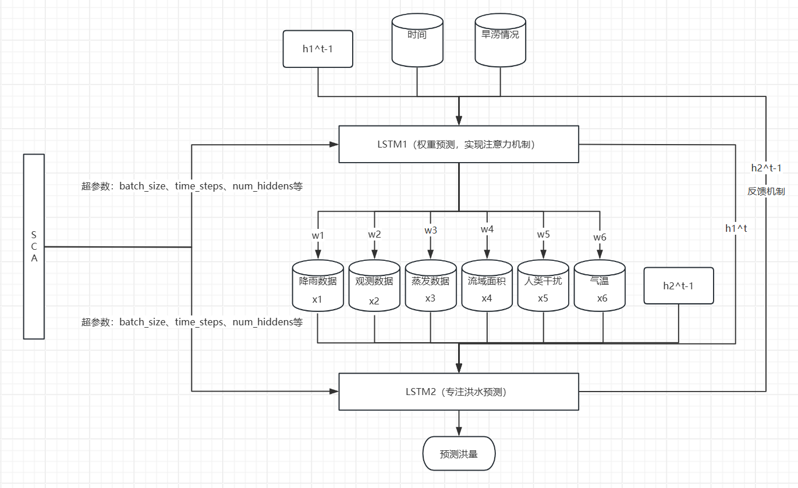
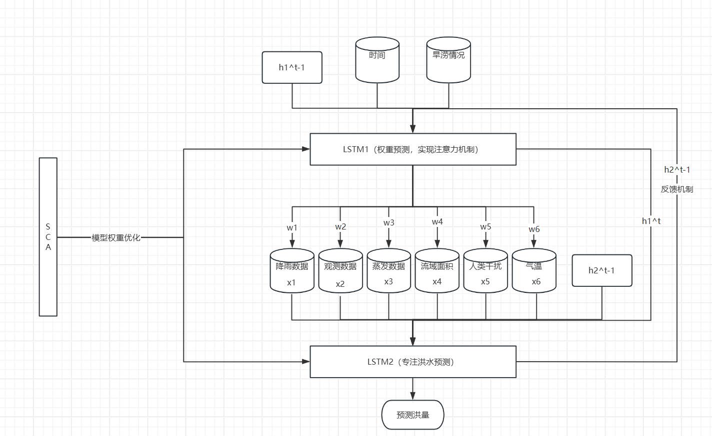

# SCA2LSTM

## 一、文献

### 1、 《Research on particle swarm optimization in LSTM neural networks for rainfall-runoff simulation》 

> PSO 的价值是 “让 LSTM 发挥最优潜力”
>
> 

PSO（粒子群优化算法）：PSO 的核心作用是**给 LSTM “调对工具”—— 自动找到最优的超参数组合**，解决 LSTM“参数靠经验、效果不稳定” 的问题

LSTM（长短期记忆网络）：LSTM 的核心作用是**处理 “随时间变化的数据”（比如降雨、径流），并记住关键规律**，专门解决传统模型 “记不住过去” 的问题。

特性： 离线优化 - 在线预测

问题：

* PSO仅用于搜索LSTM的超参数，其效果类似于网格搜索超参数，只是效率更高，搜索范围连续且更精细。
* 一旦在一个稳定的环境上找到了比较适合的超参数，那么之后就仅仅只用LSTM来预测，PSO作用就不大了，只有在下次重新训练的适合PSO才有用。

### 2、《Bottom-Up and Top-Down Attention for Image Captioning and Visual Question Answering》

> * 注意力机制：两层LSTM，第一层LSTM用作注意力机制，获取不同特征的权重，第二层接收特征与权重的加权作为输入进行预测
>
> * 反馈机制：两层LSTM的隐状态互相作为输入，互相反馈
>
> 

## 二、要求

目标是给乡镇水文站点进行流量预测，需要考虑数据不全的问题 

1、速度快

2、精度准

3、低算力

4、一定的可解释性

## 三、思路

1、模型架构 

SCA优化算法（正余弦优化算法） + LSTM1（注意力层）+ LSTM2（预测层）

2、具体结构

LSTM1 

输入：时序数据 + 属性数据 + LSTM2前一刻隐状态h2^t-1 + LSTM1前一时刻隐状态h1^t-1

输出：当前隐状态h1^t， Attend权重（时序数据和属性数据的权重）

LSTM2

输入：LSTM1此时的隐状态h1^t， 时序数据、属性数据 和 Attend权重的加权和，LSTM2前一刻隐状态h2^t-1

输出：预测的洪水流量/新安江模型参数

SCA：

对LSTM1和LSTM2的超参数进行优化，如时间步、批大小、隐藏层单元大小等

### 1、SCA2LSTM用于新安江模型参数率定

SCA用于超参数搜索 ，SCA综合性能很好

第一层LSTM注意力机制 -》数据融合，获取特征权重

第二层LSTM用于超参数预测

问题：

* 预测出的超参数会不会背离事实？ 例如预测出的张力水蓄水容量（*WM*）超出了正常范围？ -》 范围限定
* 有水文机理模型不一定适用于所有流域

### 2、SCA2LSTM直接用于洪水预测

#### 方式一: SCA优化超参数

 #### 方式二：SCA替代Adam\SGD优化模型权重

**使用反向传播得到的梯度引导SCA的方向**

### 3、创新点

1、SCA 优化

2、注意力机制

3、双重 LSTM（权重预测 + 流量预测）

4、隐状态反馈

5、多水文因子输入

6、时间编码

7、梯度引导SCA

8、多流域训练

### 4、可能出现的问题

 1、权重学歪

2、判断片面

3、关键因子被忽视

### 5、优点

1、无机理的水文预测模型 -》 适用性更强  | 通过特征权重可用判断模型是否正常工作，具有一定的可解释性

2、LSTM注意力机制-》 融合不同数据

3、数据种类缺失下的训练框架

4、数据包括时序数据和静态属性数据 （探讨静态属性数据对洪水预测的作用）

5、反馈机制

## 四、数据

### 1、基础数据

> https://hyper.ai/cn/datasets/32095 

本实验采用 CAMELS-GB 数据集，该数据集提供了英国 671 个集水区的水文气象时间序列和景观属性。它整理了英国国家河流流量档案中的河流流量、集水区属性和集水区边界以及一套新的气象时间序列和集水区属性。提供了 1970 年 10 月 1 日至 2015 年 9 月 30 日期间一系列水文气象数据（包括降雨、潜在蒸散量、温度、辐射、湿度和流量）的每日时间序列。量化了一套全面的集水区属性，描述了一系列集水区特征，包括地形、气候、水文、土地覆盖、土壤、水文地质、人类影响和排放不确定性。

#### （1）水文气象时间序列数据

| ***\*类别\**** | ***\*指标名称\**** | ***\*列号\**** | ***\*描述\****                                               | ***\*单位\**** | ***\*数据源\****                       | ***\*关联文件命名规则\****                                   | ***\*备注\****                  |
| -------------- | ------------------ | -------------- | ------------------------------------------------------------ | -------------- | -------------------------------------- | ------------------------------------------------------------ | ------------------------------- |
| 日期           | date               | 1              | 日尺度时间戳                                                 | yyyy-mm-dd     | -                                      | CAMELS_GB_hydromet_timeseries_<catchmentID>_19701001-20150930.csv | 时间范围：1970.10.01-2015.09.30 |
| 气象序列       | precipitation      | 2              | 流域日均降水量                                               | mm day⁻¹       | CEH-GEAR（Tanguy et al., 2016）        | 同上                                                         | 无缺失值                        |
|                | pet                | 3              | 流域日均潜在蒸散（Penman-Monteith 方程，无截留修正，基于 FAO 标准水草） | mm day⁻¹       | CHESS-PE（Robinson et al., 2016）      | 同上                                                         | 无缺失值，用于计算后续 PET 属性 |
|                | peti               | 7              | 流域日均潜在蒸散（含降雨日截留修正）                         | mm day⁻¹       | CHESS-PE（Robinson et al., 2017b）     | 同上                                                         | 无缺失值                        |
|                | temperature        | 4              | 流域日均气温                                                 | °C             | CHESS-met（Robinson et al., 2017a）    | 同上                                                         | 无缺失值                        |
|                | windspeed          | 11             | 流域日均风速                                                 | m s⁻¹          | CHESS-met                              | 同上                                                         | 无缺失值                        |
|                | humidity           | 8              | 流域日均比湿度                                               | g kg⁻¹         | CHESS-met                              | 同上                                                         | 无缺失值                        |
|                | shortwave_rad      | 9              | 流域日均向下短波辐射                                         | W m⁻²          | CHESS-met                              | 同上                                                         | 无缺失值                        |
|                | longwave_rad       | 10             | 流域日均长波辐射                                             | W m⁻²          | CHESS-met                              | 同上                                                         | 无缺失值                        |
| 水文序列       | discharge_spec     | 5              | 流域特定流量（按流域面积转换为深度单位）                     | mm day⁻¹       | UK National River Flow Archive（NRFA） | 同上                                                         | 缺失值标注为 “NaN”              |
|                | discharge_vol      | 6              | 流域实际流量                                                 | m³ s⁻¹         | UK NRFA                                | 同上                                                         | 缺失值标注为 “NaN”              |

#### （2）流域属性数据

##### 1. 地形属性（CAMELS_GB_topographic_attributes.txt）

| ***\*指标名称\****           | ***\*列号\**** | ***\*描述\****                          | ***\*单位\****                | ***\*数据源\****                     | ***\*备注\****       |
| ---------------------------- | -------------- | --------------------------------------- | ----------------------------- | ------------------------------------ | -------------------- |
| gauge_id                     | 1              | 流域标识（与 NRFA 测站 ID 一致）        | -                             | UK NRFA（API）                       | 核心关联 ID          |
| gauge_name                   | 2              | 测站名称（河流名 + 测站名）             | -                             | UK NRFA                              |                      |
| gauge_lat/gauge_lon          | 3/4            | 测站纬度 / 经度                         | °                             | UK NRFA                              |                      |
| gauge_easting/gauge_northing | 5/6            | 测站东向坐标 / 北向坐标（英国国家网格） | m                             | UK NRFA                              |                      |
| gauge_elev                   | 7              | 测站海拔                                | m.a.s.l（米 above sea level） | UK NRFA                              |                      |
| area                         | 8              | 流域面积                                | km²                           | CEH-IHDTM（Morris and Flavin, 1990） | 基于数字地形模型计算 |
| dpsbar                       | 9              | 流域平均排水路径坡度                    | m/km                          | CEH-IHDTM                            |                      |
| elev_mean/elev_min/elev_max  | 10/11/15       | 流域平均 / 最小 / 最大海拔              | m.a.s.l                       | CEH-IHDTM                            |                      |
| elev_10/elev_50/elev_90      | 12/13/14       | 流域海拔 10%/50%（中位数）/90% 分位数   | m.a.s.l                       | CEH-IHDTM                            |                      |

##### 2. 气候指标（CAMELS_GB_climatic_attributes.txt）

| ***\*指标名称\**** | ***\*列号\**** | ***\*描述\****                                               | ***\*单位\**** | ***\*数据源\****                           | ***\*备注\****                  |
| ------------------ | -------------- | ------------------------------------------------------------ | -------------- | ------------------------------------------ | ------------------------------- |
| gauge_id           | 1              | 流域标识                                                     | -              | UK NRFA                                    |                                 |
| p_mean             | 2              | 日均降水量均值                                               | mm day⁻¹       | 水文气象时间序列（ precipitation 字段）    | 时间范围：1970.10.01-2015.09.30 |
| pet_mean           | 3              | 日均 PET 均值（无截留修正）                                  | mm day⁻¹       | 水文气象时间序列（ pet 字段）              | 同上                            |
| aridity            | 4              | 干旱指数（PET 均值 / 降水均值）                              | -              | 基于 p_mean 与 pet_mean 计算               | 比值越高越干旱                  |
| p_seasonality      | 5              | 降水季节性（正弦曲线拟合，正值 = 夏季降水峰值，负值 = 冬季峰值，0 = 均匀） | -              | 基于降水时间序列计算                       |                                 |
| frac_snow          | 6              | 降雪占比（气温 < 0°C 日的降水占比）                          | -              | 基于 precipitation 与 temperature 字段计算 |                                 |
| high_prec_freq     | 7              | 高降水日频率（≥5 倍日均降水的天数 / 年）                     | days yr⁻¹      | 基于 precipitation 字段计算                |                                 |
| high_prec_dur      | 8              | 高降水事件平均持续时间（连续高降水日数）                     | days           | 基于 precipitation 字段计算                |                                 |
| high_prec_timing   | 9              | 高降水集中季节（djf/mam/jja/son，并列则为 NaN）              | season         | 基于 precipitation 字段计算                | djf = 冬，jja = 夏              |
| low_prec_freq      | 10             | 干旱日频率（<1mm/day 的天数 / 年）                           | days yr⁻¹      | 基于 precipitation 字段计算                |                                 |
| low_prec_dur       | 11             | 干旱期平均持续时间（连续干旱日数）                           | days           | 基于 precipitation 字段计算                |                                 |
| low_prec_timing    | 12             | 干旱集中季节（djf/mam/jja/son，并列则为 NaN）                | season         | 基于 precipitation 字段计算                |                                 |

##### 3. 水文特征（CAMELS_GB_hydrologic_attributes.txt）

| ***\*指标名称\**** | ***\*列号\**** | ***\*描述\****                                              | ***\*单位\****     | ***\*数据源\****                          | ***\*备注\****                  |
| ------------------ | -------------- | ----------------------------------------------------------- | ------------------ | ----------------------------------------- | ------------------------------- |
| gauge_id           | 1              | 流域标识                                                    | -                  | UK NRFA                                   |                                 |
| q_mean             | 2              | 日均流量均值                                                | mm day⁻¹           | 水文气象时间序列（ discharge_spec 字段）  | 时间范围：1970.10.01-2015.09.30 |
| runoff_ratio       | 3              | 径流系数（q_mean/p_mean）                                   | -                  | 基于 q_mean 与 p_mean 计算                | 比值≤1                          |
| stream_elas        | 4              | 流量 - 降水弹性（年尺度流量对降水变化的敏感度）             | -                  | 基于 precipitation 与 discharge_spec 计算 |                                 |
| slope_fdc          | 5              | 流量持续曲线斜率（对数转换后 33%-66% 分位数间斜率）         | -                  | 基于 discharge_spec 字段计算              | 反映流量稳定性                  |
| baseflow_index     | 6              | 基流指数（基流均值 / 流量均值，Ladson et al., 2013 滤波法） | -                  | 基于 discharge_spec 字段计算              |                                 |
| baseflow_index_ceh | 7              | 基流指数（Gustard et al., 1992 方法）                       | -                  | 基于 discharge_spec 字段计算              | 与 baseflow_index 方法不同      |
| hfd_mean           | 8              | 平均半流量日（10 月 1 日起累计流量达年总量 50% 的天数）     | days since 1st Oct | 基于 discharge_spec 字段计算              |                                 |
| Q5/Q95             | 9/10           | 5%/95% 流量分位数（低流量 / 高流量阈值）                    | mm day⁻¹           | 基于 discharge_spec 字段计算              |                                 |
| high_q_freq        | 11             | 高流量日频率（>9 倍日均流量的天数 / 年）                    | days yr⁻¹          | 基于 discharge_spec 字段计算              |                                 |
| high_q_dur         | 12             | 高流量事件平均持续时间                                      | days               | 基于 discharge_spec 字段计算              |                                 |
| low_q_freq         | 13             | 低流量日频率（<0.2 倍日均流量的天数 / 年）                  | days yr⁻¹          | 基于 discharge_spec 字段计算              |                                 |
| low_q_dur          | 14             | 低流量事件平均持续时间                                      | days               | 基于 discharge_spec 字段计算              |                                 |
| zero_q_freq        | 15             | 零流量日占比                                                | %                  | 基于 discharge_spec 字段计算              |                                 |

##### 4. 土地覆盖（CAMELS_GB_landcover_attributes.txt）

| ***\*指标名称\**** | ***\*列号\**** | ***\*描述\****                                           | ***\*单位\**** | ***\*数据源\****                   | ***\*备注\****                        |
| ------------------ | -------------- | -------------------------------------------------------- | -------------- | ---------------------------------- | ------------------------------------- |
| gauge_id           | 1              | 流域标识                                                 | -              | UK NRFA                            |                                       |
| dwood_perc         | 2              | 落叶林覆盖占比                                           | %              | UK LCM2015（Rowland et al., 2017） | 1km 网格数据，与 NRFA 的 LCM2000 不同 |
| ewood_perc         | 3              | 常绿林覆盖占比                                           | %              | UK LCM2015                         |                                       |
| grass_perc         | 4              | 草地与牧场覆盖占比                                       | %              | UK LCM2015                         |                                       |
| shrub_perc         | 5              | 灌木覆盖占比                                             | %              | UK LCM2015                         |                                       |
| crop_perc          | 6              | 农作物覆盖占比                                           | %              | UK LCM2015                         |                                       |
| urban_perc         | 7              | 城镇与郊区覆盖占比                                       | %              | UK LCM2015                         |                                       |
| inwater_perc       | 8              | 内陆水体覆盖占比                                         | %              | UK LCM2015                         |                                       |
| bares_perc         | 9              | 裸土与岩石覆盖占比                                       | %              | UK LCM2015                         |                                       |
| dom_land_cover     | 10             | 主导土地覆盖类型（草地 / 灌木 / 落叶林 / 常绿林 / 城镇） | -              | UK LCM2015                         | 取占比最高的类型                      |

##### 5. 土壤属性（CAMELS_GB_soil_attributes.txt）

| ***\*指标名称\****                     | ***\*列号\**** | ***\*描述\****                                               | ***\*单位\**** | ***\*数据源\****                                             | ***\*备注\****                                           |
| -------------------------------------- | -------------- | ------------------------------------------------------------ | -------------- | ------------------------------------------------------------ | -------------------------------------------------------- |
| gauge_id                               | 1              | 流域标识                                                     | -              | UK NRFA                                                      |                                                          |
| sand_perc/silt_perc/clay_perc          | 2/4/6          | 砂 / 粉砂 / 黏粒含量占比                                     | %              | 欧洲土壤数据库（Hiederer, 2013a/b）+ Pelletier et al., 2016 基岩深度数据 | 含对应 “_missing” 字段（3/5/7 列），标注无数据单元格占比 |
| organic_perc                           | 8              | 有机碳含量占比                                               | %              | 同上                                                         | 含 “organic_perc_missing”（9 列）                        |
| bulkdens                               | 10             | 土壤容重                                                     | g cm⁻³         | 同上                                                         | 含容重分位数（12-14 列）及缺失值（11 列）                |
| tawc                                   | 15             | 总有效含水量                                                 | mm             | 同上                                                         | 含含水量分位数（17-19 列）及缺失值（16 列）              |
| porosity_cosby/porosity_hypres         | 20/25          | 孔隙度（基于砂黏粒的 Cosby 公式 / 基于多参数的 Hypres 公式） | -              | 同上                                                         | 含孔隙度分位数及缺失值字段                               |
| conductivity_cosby/conductivity_hypres | 30/35          | 饱和导水率（对应孔隙度计算方法）                             | cm h⁻¹         | 同上                                                         | 含导水率分位数及缺失值字段                               |
| root_depth                             | 40             | 根系可利用深度                                               | m              | 同上                                                         | 含深度分位数（42-44 列）及缺失值（41 列）                |
| soil_depth_pelletier                   | 45             | 基岩深度（最大 50m）                                         | m              | Pelletier et al., 2016                                       | 含深度分位数（47-49 列）及缺失值（46 列）                |

##### 6. 水文地质属性（CAMELS_GB_hydrogeology_attributes.txt）

| ***\*指标名称\**** | ***\*列号\**** | ***\*描述\****                           | ***\*单位\**** | ***\*数据源\****                       | ***\*备注\****                            |
| ------------------ | -------------- | ---------------------------------------- | -------------- | -------------------------------------- | ----------------------------------------- |
| gauge_id           | 1              | 流域标识                                 | -              | UK NRFA                                | 仅适用于区域 / 国家尺度对比，不适用子流域 |
| inter_high_perc    | 2              | 高生产力粒间流含水层占比                 | %              | BGS 水文地质图（2019）+ BGS 表层沉积图 |                                           |
| inter_mod_perc     | 3              | 中生产力粒间流含水层占比                 | %              | 同上                                   |                                           |
| inter_low_perc     | 4              | 低生产力粒间流含水层占比                 | %              | 同上                                   |                                           |
| frac_high_perc     | 5              | 高生产力裂隙流含水层占比                 | %              | 同上                                   |                                           |
| frac_mod_perc      | 6              | 中生产力裂隙流含水层占比                 | %              | 同上                                   |                                           |
| frac_low_perc      | 7              | 低生产力裂隙流含水层占比                 | %              | 同上                                   |                                           |
| no_gw_perc         | 8              | 无地下水岩石区域占比                     | %              | 同上                                   |                                           |
| low_nsig_perc      | 9              | 低生产力粒间流（含非重要含水层）区域占比 | %              | 同上                                   |                                           |
| nsig_low_perc      | 10             | 非重要含水层（含低生产力粒间流）区域占比 | %              | 同上                                   |                                           |

##### 7. 水文测量属性（CAMELS_GB_hydrometry_attributes.txt）

| ***\*指标名称\****                | ***\*列号\**** | ***\*描述\****                                               | ***\*单位\**** | ***\*数据源\****                        | ***\*备注\****           |
| --------------------------------- | -------------- | ------------------------------------------------------------ | -------------- | --------------------------------------- | ------------------------ |
| gauge_id                          | 1              | 流域标识                                                     | -              | UK NRFA                                 |                          |
| station_type                      | 2              | 测站类型（如 B = 宽顶堰、EM = 电磁测站、US = 超声波测站等，可标注高低流类型） | -              | UK NRFA（API）                          | 详见文档表 8 注释        |
| flow_period_start/flow_period_end | 3/4            | 流量数据起始 / 结束日期                                      | yyyy-mm-dd     | 水文气象时间序列（discharge_spec 字段） |                          |
| flow_perc_complete                | 5              | 流量数据完整率（1970.10.01-2015.09.30）                      | %              | 基于流量时间序列计算                    |                          |
| bankfull_flow                     | 6              | 漫滩流量（基于水位 - 流量关系，可能外推）                    | m³ s⁻¹         | UK NRFA（API）                          |                          |
| structurefull_flow                | 7              | 结构过流流量（如堰墙过流，可能外推）                         | m³ s⁻¹         | UK NRFA（API）                          |                          |
| qXX_uncert_upper/qXX_uncert_lower | 8/9 等         | XX% 分位数流量的不确定性上 / 下界（XX=5,25,50,75,95,99）     | %              | Coxon et al., 2015                      | 占对应分位数流量的百分比 |
| quncert_meta                      | 20             | 流量不确定性元数据（如 “有计算结果”“无水位 - 流量数据” 等）  | -              | Coxon et al., 2015                      | 解释不确定性数据有效性   |

##### 8. 人类影响属性（CAMELS_GB_humaninfluence_attributes.txt）

| ***\*指标名称\****                         | ***\*列号\**** | ***\*描述\****                                               | ***\*单位\**** | ***\*数据源\****                                      | ***\*备注\****                                               |
| ------------------------------------------ | -------------- | ------------------------------------------------------------ | -------------- | ----------------------------------------------------- | ------------------------------------------------------------ |
| gauge_id                                   | 1              | 流域标识                                                     | -              | UK NRFA                                               | 英格兰外流域数据多为 NaN                                     |
| benchmark_catch                            | 2              | 是否为基准流域（Y = 是，N = 否）                             | Y/N            | UK NRFA（Harrigan et al., 2018）                      | 基准流域受人类干扰较少                                       |
| surfacewater_abs                           | 3              | 地表水平均开采量                                             | mm day⁻¹       | 英国环境署（EA）数据                                  | 仅英格兰有数据，含 “NaN”                                     |
| groundwater_abs                            | 4              | 地下水平均开采量                                             | mm day⁻¹       | 同上                                                  | 同上                                                         |
| discharges                                 | 5              | 平均排放量（如污水处理厂出水）                               | mm day⁻¹       | 同上                                                  | 同上                                                         |
| abs_agriculture_perc/abs_amenities_perc 等 | 6-11           | 农业 / 公共设施 / 能源 / 环境 / 工业 / 供水的开采量占总开采量的百分比 | %              | 同上                                                  | 共 6 类用途，仅英格兰有数据                                  |
| num_reservoir                              | 12             | 流域内水库数量                                               | -              | UK 水库清单（Durant and Counsell, 2018）+ SEPA 登记册 |                                                              |
| reservoir_cap                              | 13             | 水库总库容                                                   | ML（兆升）     | 同上                                                  |                                                              |
| reservoir_he/reservoir_nav 等              | 14-19          | 水力发电 / 航运 / 排水 / 水资源 / 防洪 / 环境用途的水库库容占比 | %              | 同上                                                  | 共 6 类用途，含 “_nousedata”（20 列）标注无用途数据的库容占比 |
| reservoir_year_first/reservoir_year_last   | 21/22          | 流域内首个 / 最后一个水库建成年份                            | -              | 同上                                                  |                                                              |

#### （3）流域边界数据

| ***\*数据类型\**** | ***\*格式\****         | ***\*投影方式\**** | ***\*描述\****                                    | ***\*关联文件名称\****         | ***\*数据源\****                     |
| ------------------ | ---------------------- | ------------------ | ------------------------------------------------- | ------------------------------ | ------------------------------------ |
| 流域边界           | ESRI Shapefile（.shp） | 英国国家网格       | 671 个流域的空间边界，基于 CEH-IHDTM 地形模型提取 | CAMELS_GB_catchment_boundaries | CEH-IHDTM（Morris and Flavin, 1990） |

#### （4）备注

**1.** ***\*数据关联\****：所有属性文件均通过 “gauge_id” 与水文气象时间序列文件关联，可直接匹配同一流域的多维度数据。

**2.** ***\*缺失值标注\****：流量数据（discharge_*）、人类影响属性（英格兰外）、部分土壤 / 水文地质属性的缺失值统一标注为 “NaN”，需在分析前筛选。

 ### 2、数据选择

#### 时序数据（8 个，随时间变化，核心驱动 + 动态补充）

| 指标名称               | 列号 | 单位     | 核心作用（为什么选）                                         |
| ---------------------- | ---- | -------- | ------------------------------------------------------------ |
| precipitation          | 2    | mm day⁻¹ | 洪水的直接 “补给源”—— 降雨量是产流核心，无降雨则无洪水，是预测的基础前提，必须选 |
| peti                   | 3    | mm day⁻¹ | 洪水的 “核心损耗项”—— 含降雨日截留修正，整合风速 / 湿度 / 辐射，比普通 PET 更贴合实际蒸散损耗，影响径流生成量 |
| temperature            | 4    | °C       | 调节 “补给 - 损耗” 效率 —— 影响寒区融雪补流、蒸散强度，间接改变产流效率，覆盖双重调节作用 |
| discharge_vol          | 5    | m³ s⁻¹   | 前期 “基础状态”—— 实际流量反映流域当前水量储备，洪水是时序连续过程，决定预测基准，比深度单位更直观 |
| high_prec_running_days | 6    | 天       | 捕捉 “高降水延续性”—— 反映当前暴雨已持续时长，是洪水叠加、峰值预判的关键，基础指标无法替代 |
| low_prec_running_days  | 7    | 天       | 捕捉 “干旱累积性”—— 反映流域中长期干旱状态，干旱越久土壤储水越少，后续降雨越易饱和产流 |
| prec_7day_sum          | 8    | mm       | 捕捉 “短期暴雨集中”—— 弥补单日降水不足，反映 3-7 天强降雨累积效应，是洪水峰值的核心驱动 |
| prec_30day_sum         | 9    | mm       | 捕捉 “中长期干湿背景”—— 反映土壤饱和状态，决定降雨转化为径流的比例，适配不同气候区需求 |

#### 静态数据（15 个，固定不变，影响降雨 - 径流转化全链条）

| 指标名称        | 所属类别 | 单位    | 核心作用（为什么选）                                         |
| --------------- | -------- | ------- | ------------------------------------------------------------ |
| area            | 地形属性 | km²     | 决定洪水 “规模上限”—— 流域面积越大，相同降雨量下洪水峰值可能越高，是基础约束指标 |
| dpsbar          | 地形属性 | m/km    | 影响 “汇流速度”—— 坡度越陡，降雨汇流越快，洪水峰值出现越早、越集中，关键地形因子 |
| elev_mean       | 地形属性 | m.a.s.l | 补充 “垂直调节”—— 影响积雪分布（寒区）、降水强度，形成 “规模 + 速度 + 垂直” 三维地形约束 |
| aridity         | 气候指标 | -       | 反映 “干湿特性”—— 干旱指数（PET / 降水）凝练补给 - 损耗比例，比单独选均值更简洁无冗余 |
| p_seasonality   | 气候指标 | -       | 区分 “洪水类型”—— 反映降水季节分布，适配暴雨洪水（夏季峰值）或融雪洪水（冬季峰值） |
| tawc            | 土壤属性 | mm      | 决定 “储水总量”—— 总有效含水量越高，土壤储水能力越强，暴雨期饱和产流阈值越高 |
| porosity_cosby  | 土壤属性 | -       | 决定 “储水结构”—— 孔隙度越大，储水效率越高，产流速度越慢，与 tawc 形成 “总量 + 结构” 双约束 |
| baseflow_index  | 水文特征 | -       | 反映 “地下水补给”—— 基流指数越高，洪水退水越慢，直接影响洪水过程模拟精度，无替代指标 |
| dwood_perc      | 土地覆盖 | %       | 强截留 + 强下渗 —— 落叶林占比越高，产流越少，洪水峰值越小，覆盖核心下垫面类型 |
| ewood_perc      | 土地覆盖 | %       | 最强截留 + 强下渗 —— 常绿林占比越高，产流越少，补充落叶林覆盖的季节差异 |
| grass_perc      | 土地覆盖 | %       | 中等截留 + 中等下渗 —— 草地占比反映自然植被中等产流特性，无冗余覆盖 |
| urban_perc      | 土地覆盖 | %       | 弱截留 + 弱下渗 —— 城镇占比越高，产流越多，洪水峰值越大，唯一反映人工硬化地面影响的指标 |
| inwater_perc    | 土地覆盖 | %       | 无截留 + 无下渗 —— 水体占比反映直接产流贡献，退水快，补充下垫面完整覆盖 |
| benchmark_catch | 人类影响 | 1/0     | 定性 “人类干扰”—— 区分是否为基准流域，排除水利工程、开采导致的数据失真，确保自然水文规律学习 |
| reservoir_cap   | 人类影响 | ML      | 定量 “调蓄能力”—— 水库总库容越大，洪水削峰效果越强，与 benchmark_catch 形成 “定性 + 定量” 双约束 |

### 3、筛选逻辑（为什么选这些，不选其他？）

#### 时序数据：核心驱动 + 动态补充，无冗余适配模型

・必选核心：precipitation（降雨）、discharge_vol（前期流量）—— 缺则无法模拟 “降雨补流 + 时序连续” 的洪水核心过程，是预测底线；

・关键辅助：peti（蒸散损耗）、temperature（调节转化）—— 直接影响 “降雨转径流” 效率，peti 已整合风速、湿度等中间变量，温度覆盖融雪、蒸散双重作用，无冗余；

・动态补充：4 个衍生指标 —— 分别解决 “持续时长、干旱累积、短期集中、中长期干湿”4 个基础指标无法覆盖的痛点，适配 LSTM 时序依赖学习，且基于降水直接计算，无额外数据源需求；

・不选的理由：windspeed、humidity、shortwave_rad 等是 peti 的中间计算变量，再选冗余；discharge_spec 与 discharge_vol 信息重复，选更直观的实际流量单位；无其他时序指标能替代动态衍生的 “持续 + 累计” 特性。

#### 静态数据：全链条覆盖 + 无重叠，聚焦转化效率关键因子

・地形类：选 area+dpsbar+elev_mean—— 覆盖 “水平规模 + 汇流速度 + 垂直调节”，排除 elev_max、slope_std 等次要指标，避免信息重叠；

・气候类：选 aridity+p_seasonality—— 一个反映 “补给 - 损耗比例”，一个反映 “季节分布”，比单独选 p_mean、pet_mean 更凝练，无冗余；

・土壤类：选 tawc+porosity_cosby—— 覆盖 “储水总量 + 空间结构”，排除土壤质地细分指标，聚焦产流核心影响；

・水文类：选 baseflow_index—— 唯一反映地下水补给和退水特性的指标，无替代；

・土地覆盖类：选 5 个量化占比 —— 完整覆盖 “森林 / 草地 / 城镇 / 水体” 四大核心下垫面，排除 shrub_perc（与草地冗余）、bares_perc（占比极低无价值），量化占比比分类指标更精准；

・人类影响类：选 benchmark_catch+reservoir_cap—— 定性 + 定量结合，覆盖 “干扰有无 + 调控强度”，排除其他人类活动细分指标，聚焦洪水调蓄核心影响；

・不选的理由：所有未选静态指标要么与核心指标冗余（如 shrub_perc- grass_perc），要么影响微弱（如 bares_perc），要么数据完整性低（如部分细分土壤指标），纳入会稀释核心指标权重。

### 4、数据处理

#### 输入

时序文件 + 静态属性文件

#### 输出

23维特征数据

#### 处理方式

以下是基于 **方案 1（静态指标用「物理意义绝对参考范围」做单流域归一化）** 的所有指标完整处理总结，整合之前达成的共识（时序指标不丢极端值、分场景缺失值填充等），兼顾当前多流域训练和未来单流域落地：

##### 核心统一原则

1. 缺失值：时序仅填充`discharge_vol`和极端事件前后缺失值，其余（含静态）保留 NaN；
2. 异常值：区分「真实极端值」和「错误数据」，仅修正 / 截断错误数据，保留所有合理极端值；
3. 归一化：
   - 时序指标：单流域自身处理后数据的 min-max 缩放（保留流域内波动特征）；
   - 静态指标：单流域独立缩放（基于指标物理参考范围，无需依赖其他流域数据）；
4. 反归一化：保存关键参数（时序 min/max、静态参考范围），确保预测值可还原真实值。

##### 一、时序基础指标（4 个）：核心保留极端值，分场景处理

| 指标名称              | 处理步骤                                                     | 关键说明（含共识落地）                                       |
| --------------------- | ------------------------------------------------------------ | ------------------------------------------------------------ |
| precipitation（降水） | 1. 读取原始日尺度数据（单位：mm）；2. 缺失值：- 常规缺失：单个→前后均值，连续→7 天滚动均值；- 极端事件前后缺失：用极端日值 ×0.8 填充；3. 异常值（双约束判定）：- 物理硬约束：0≤日降水≤500mm（沿海台风区可放宽至 800mm）；- 流域自适应阈值：历史最大日降水 ×1.2；- 处理：超物理上限→修正为上限，超自适应阈值但未超物理上限→截断为自适应阈值，其余保留（含真实暴雨）；4. 归一化：单流域 min-max 缩放（min = 处理后最小值，max = 处理后最大值）；5. 反归一化：`真实值=归一化值×(max-min)+min`（需保存训练集 min/max）。 | 核心：不丢真实极端暴雨（如百年一遇 150mm），仅剔除错误值（如 1000mm）；正常 0 值：无降水日（合理）。 |
| peti（潜在蒸散发）    | 1. 读取原始数据（单位：mm）；2. 缺失值：同「precipitation」；3. 异常值：- 物理硬约束：0≤日蒸散发≤20mm；- 流域自适应阈值：历史最大 ×1.2；- 处理：超阈值截断，其余保留；4. 归一化 / 反归一化：同「precipitation」。 | 无自然 0 值，若出现 0→原始数据异常或关联错误；保留合理极端蒸散发（如高温天 15mm）。 |
| temperature（气温）   | 1. 读取原始日平均气温（单位：℃）；2. 缺失值：同「precipitation」；3. 异常值：- 物理硬约束：-40℃≤气温≤45℃；- 流域自适应阈值：历史极值 ×1.1；- 处理：超阈值截断；4. 归一化 / 反归一化：同「precipitation」。 | 无自然固定 0 值，保留极端高温 / 低温（如 40℃、-30℃），剔除传感器错误值（如 60℃）。 |
| discharge_vol（流量） | 1. 读取原始日尺度流量（单位：m³/s）；2. 缺失值：- 非洪水期：7 天滚动均值；- 洪水期：同期洪水窗口均值；- 极端事件前后：用极端流量 ×0.8 填充；3. 异常值：- 物理硬约束：流量≥0，≤流域最大可能汇流能力；- 流域自适应阈值：历史最大流量 ×1.2；- 处理：负数→0，超阈值截断；4. 归一化 / 反归一化：同「precipitation」。 | 核心：保留特大洪水流量（如百年一遇 500m³/s），确保模型学习极端洪水特征；正常 0 值：枯水期极小流量（合理）。 |

##### 二、时序衍生指标（4 个）：基于基础指标计算，保留极端特征

| 指标名称                                 | 处理步骤                                                     | 关键说明                                                     |
| ---------------------------------------- | ------------------------------------------------------------ | ------------------------------------------------------------ |
| high_prec_running_days（高降水持续天数） | 1. 计算依据：基于处理后的「precipitation」；2. 高降水阈值：流域历史日均降水 ×3（避免误判）；3. 计算逻辑：连续高降水日累计（非高降水日→0）；4. 异常值：无（累计值无错误，仅受基础降水约束）；5. 归一化：单流域 min-max 缩放（max = 处理后最大累计天数）。 | 正常 0 值：非高降水日（合理）；极端值：连续 5 天高降水→归一化后接近 1，保留模型可学习。 |
| low_prec_running_days（干旱持续天数）    | 1. 低降水阈值：＜1mm/day；2. 计算逻辑：连续低降水日累计（非低降水日→0）；3. 异常值：无；4. 归一化：单流域 min-max 缩放。 | 正常 0 值：非干旱日（合理）；极端值：连续 30 天干旱→保留，适配干旱后洪水预测。 |
| prec_7day_sum（7 天累计降水）            | 1. 计算：处理后「precipitation」的 7 天滚动求和（min_periods=1）；2. 异常值：继承基础降水的约束（无额外处理）；3. 归一化：单流域 min-max 缩放。 | 极端值：7 天累计 500mm（暴雨过程）→保留，模型学习连续降水致洪特征；正常 0 值：连续 7 天无降水（合理）。 |
| prec_30day_sum（30 天累计降水）          | 1. 计算：处理后「precipitation」的 30 天滚动求和（min_periods=7）；2. 异常值：继承基础降水的约束；3. 归一化：单流域 min-max 缩放。 | 极端值：30 天累计 800mm（汛期连续降水）→保留；NaN：有效数据不足 7 天（合理）。 |

##### 三、静态指标（15 个）：方案 1 核心落地，单流域独立缩放

| 指标类别 | 指标名称                        | 处理步骤                                                     | 关键说明（解决单个数据归一化问题）                           |
| -------- | ------------------------------- | ------------------------------------------------------------ | ------------------------------------------------------------ |
| 地形属性 | area（流域面积）                | 1. 读取：从地形静态文件提取（gauge_id 匹配 catchment_id）；2. 缺失值：保留 NaN（不填充 0）；3. 异常值：物理约束（0＜area≤10000km²，超则截断为 10000）；4. 归一化（方案 1）：参考范围（min_ref=0，max_ref=10000km²）；公式：`x_norm=(x - min_ref)/(max_ref - min_ref)`，超范围截断到 [0,1]；5. 反归一化：`x_real=x_norm×(max_ref - min_ref)+min_ref`（保存参考范围即可）。 | 单个数据归一化逻辑：用物理参考范围替代自身 min-max，如 area=100km²→归一化后 = 0.01（非 0）；全 0 原因：关联失败→原始值为 NaN→误填充 0（正确应保留 NaN）。 |
| 地形属性 | dpsbar（平均坡度）              | 1. 读取：地形静态文件提取；2. 缺失值：NaN；3. 异常值：物理约束（0≤dpsbar≤50°，超则截断）；4. 归一化：参考范围（0,50°），公式同上；5. 反归一化：同上。 | 原始值不可能为 0（实际流域必有坡度），归一化后非 0；如坡度 10°→0.2，坡度 30°→0.6，保留流域差异。 |
| 地形属性 | elev_mean（平均海拔）           | 1. 读取：地形静态文件提取；2. 缺失值：NaN；3. 异常值：物理约束（0≤elev_mean≤5000m，青藏高原可放宽到 8000m）；4. 归一化：参考范围（0,5000m）；5. 反归一化：同上。 | 全 0→关联失败（海拔不可能为 0）；如海拔 1000m→0.2，海拔 3000m→0.6，适配不同地形流域。 |
| 气候指标 | aridity（干旱指数）             | 1. 读取：气候静态文件提取；2. 缺失值：NaN；3. 异常值：物理约束（0≤aridity≤2，超则截断）；4. 归一化：参考范围（0,2）；5. 反归一化：同上。 | 归一化后 0.2→干旱，0.8→半湿润，1.5→湿润，保留气候差异；全 0→关联失败（极端湿润罕见）。 |
| 气候指标 | p_seasonality（降水季节性）     | 1. 读取：气候静态文件提取；2. 缺失值：NaN；3. 异常值：物理约束（0≤p_seasonality≤1）；4. 归一化：参考范围（0,1）（原始已标准化）；5. 反归一化：同上。 | 0→无季节性，1→极强季节性，归一化后直接保留原始特征；全 0→可能为真实无季节性（罕见）或关联失败。 |
| 土壤属性 | tawc（总可用含水量）            | 1. 读取：土壤静态文件提取；2. 缺失值：NaN；3. 异常值：物理约束（0≤tawc≤200mm）；4. 归一化：参考范围（0,200mm）；5. 反归一化：同上。 | 原始值不可能为 0（土壤必有含水量），如 tawc=100mm→归一化后 = 0.5；全 0→关联失败。 |
| 土壤属性 | porosity_cosby（孔隙度）        | 1. 读取：土壤静态文件提取；2. 缺失值：NaN；3. 异常值：物理约束（0.2≤porosity≤0.6）；4. 归一化：参考范围（0.2,0.6）；5. 反归一化：同上。 | 如孔隙度 0.3→(0.3-0.2)/(0.6-0.2)=0.25，保留土壤差异；全 0→关联失败。 |
| 水文特征 | baseflow_index（基流指数）      | 1. 读取：水文静态文件提取；2. 缺失值：NaN；3. 异常值：物理约束（0≤baseflow_index≤1）；4. 归一化：参考范围（0,1）；5. 反归一化：同上。 | 0→无基流，0.5→基流占比 50%，归一化后保留水文特征；全 0→可能为真实无基流（罕见）或关联失败。 |
| 土地覆盖 | dwood_perc（落叶林占比）        | 1. 读取：土地覆盖静态文件提取；2. 缺失值：NaN；3. 异常值：物理约束（0≤dwood_perc≤1）；4. 归一化：参考范围（0,1）；5. 反归一化：同上。 | 正常 0 值→无落叶林（合理）；如占比 0.3→归一化后 = 0.3，保留植被差异。 |
| 土地覆盖 | ewood_perc（常绿林占比）        | 同「dwood_perc」处理逻辑                                     | 正常 0 值→无常绿林（合理）；归一化后保留植被类型差异。       |
| 土地覆盖 | grass_perc（草地占比）          | 同「dwood_perc」处理逻辑                                     | 正常 0 值→无草地（合理）；如占比 0.6→归一化后 = 0.6，适配草原流域。 |
| 土地覆盖 | urban_perc（城镇占比）          | 1. 读取：土地覆盖静态文件提取；2. 缺失值：NaN；3. 异常值：物理约束（0≤urban_perc≤0.5）；4. 归一化：参考范围（0,0.5）；5. 反归一化：同上。 | 正常 0 值→无城镇（自然流域合理）；如占比 0.2→(0.2-0)/(0.5-0)=0.4，保留人类活动影响差异。 |
| 土地覆盖 | inwater_perc（水域占比）        | 1. 读取：土地覆盖静态文件提取；2. 缺失值：NaN；3. 异常值：物理约束（0≤inwater_perc≤0.2）；4. 归一化：参考范围（0,0.2）；5. 反归一化：同上。 | 正常 0 值→无水域（合理）；如占比 0.1→归一化后 = 0.5，保留湿地 / 湖区特征。 |
| 人类影响 | benchmark_catch（基准流域标识） | 1. 读取：人类影响静态文件提取（Y/N）；2. 转换：Y→1，N→0；3. 缺失值：NaN；4. 归一化：参考范围（0,1）；5. 反归一化：同上。 | 正常 0 值→非基准流域（合理）；归一化后直接保留标识特征，适配无人类干扰流域的学习。 |
| 人类影响 | reservoir_cap（水库库容）       | 1. 读取：人类影响静态文件提取；2. 缺失值：NaN（无水库→合理 NaN）；3. 异常值：物理约束（0≤reservoir_cap≤1e9m³）；4. 归一化：参考范围（0,1e9m³）；5. 反归一化：同上。 | 正常 0 值→无水库（合理）；如库容 5e8m³→归一化后 = 0.5，保留水利工程影响差异。 |

##### 四、辅助列（2 个）：数据管理与关联

| 列名                    | 处理步骤                                                     | 作用                                                         |
| ----------------------- | ------------------------------------------------------------ | ------------------------------------------------------------ |
| date（日期）            | 1. 读取原始时序数据的日期列；2. 格式转换：转为 datetime 类型；3. 保留至最终输出。 | 时间排序、数据集划分（按时间划分训练 / 验证 / 测试集，避免数据泄露）、结果追溯。 |
| catchment_id（流域 ID） | 1. 新增列：填充当前处理的流域 ID（整数类型）；2. 保留至最终输出。 | 多流域数据合并、流域标识、预测时匹配对应缩放器（时序 min/max、静态参考范围）。 |

##### 五、核心解决的历史问题

1. 静态指标全 0：通过「物理参考范围 + 单流域独立缩放」，单个静态值不再因自身 min-max=0 而变为 0，如 area=100km²→归一化后 = 0.01；
2. 极端值丢失：时序指标用「物理约束 + 流域自适应阈值」，仅剔除错误数据，保留所有合理极端值（暴雨、特大洪水）；
3. 单流域适配：静态指标归一化无需依赖其他流域数据，未来国内单流域直接复用参考范围，零成本切换；
4. 反归一化闭环：时序保存 min/max，静态保存参考范围，预测后可准确还原真实值（含极端洪水流量）。

##### 六、关键落地注意事项

1. 静态参考范围可微调：根据数据集调整（如国内流域面积多在 0-5000km²，可将 area 的 max_ref 改为 5000，让归一化值分布更均匀）；
2. 关联逻辑是核心：静态指标全 0 的根源是 gauge_id 匹配失败→原始值为 NaN→误填充 0，需优先确保静态文件与时序文件的关联正确；
3. 保留原始数据与参数：每个流域需保存「时序 min/max」「静态参考范围」「原始静态值」，方便后续反归一化和模型调优；
4. 极端事件前后缺失值：需通过日期判断是否为极端事件（如降水 > 历史均值 ×5），再用对应逻辑填充，避免掩盖极端事件前兆。

该总结完全适配方案 1，可直接作为后续代码修改的核心依据，兼顾多流域训练和单流域落地，同时解决了之前的全 0、极端值丢失等关键问题。

## 六、消融实验

1、SCA的权重优化效果： 和Adam对比

2、注意力机制的效果：去掉

3、反馈机制的效果：去掉

4、数据输入顺序的效果：对换

